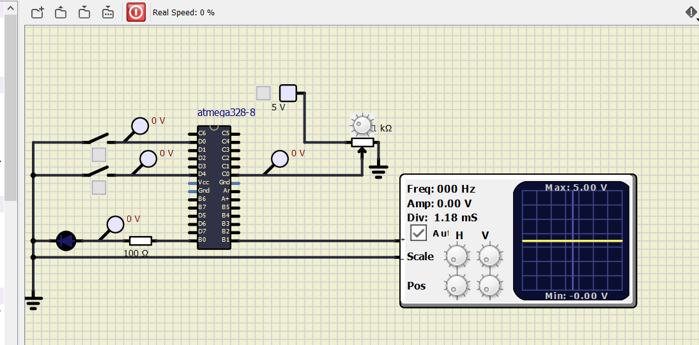
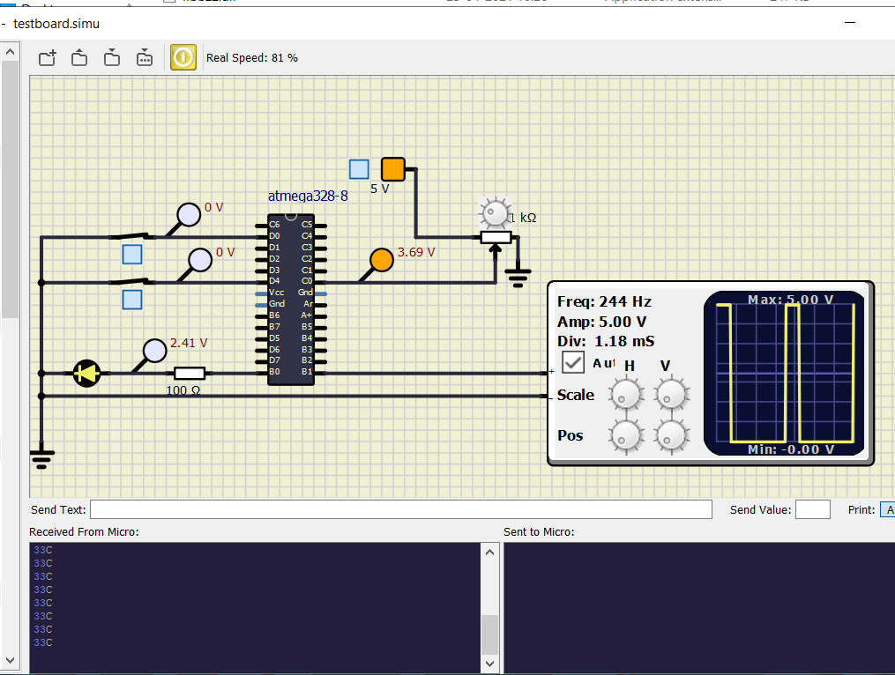

# LTTS stepin Mini Project-2
# EMBEDDED-C CASE STUDY
|Build|Cppcheck|Codacy|
|:--:|:--:|:--:|
|||

## AUTOMATIC SEAT HEAT CONTROLLER IN CAR

ABOUT WORKING:
This Controller aims at control the temperature in the car. Whenever a person seated in the car, button sensor activated and heater sensor also activated after it. Temperature sensor keeps monitor the temperature and sends analog value to atmega328 microcontroller. Microcontroller perform the certain operations and produce the required output.

### In Action

####  Car seat vacant and heater switch is off

####  Car seat is occupied and heater switch is on

